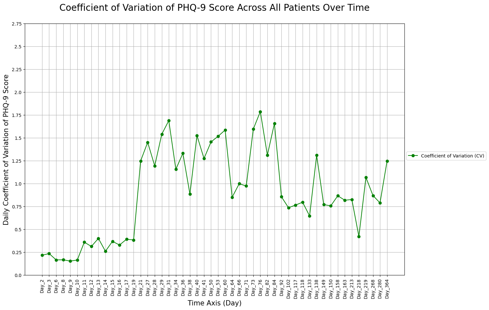
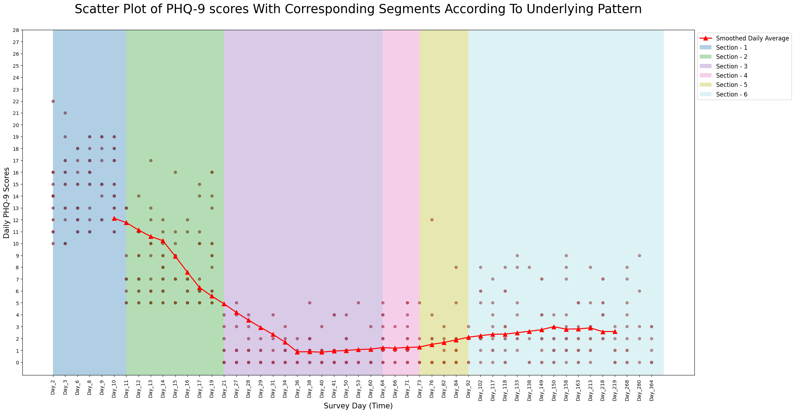
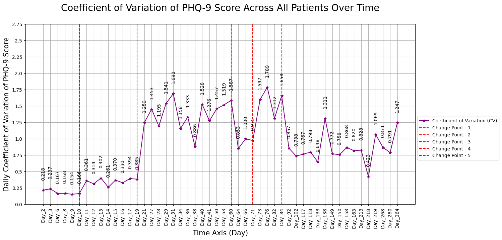

# PHQ-9 Temporal Change-point Detection

[](https://www.python.org/downloads/)
[](https://opensource.org/licenses/MIT)
[](https://github.com/psf/black)

> **Temporal clustering and change point detection framework for analyzing mental health trajectories using PHQ-9 scores over time. Includes synthetic data generation, comprehensive EDA, and robust statistical interpretation using PELT algorithm with LASSO regularization.**

This repository presents an end-to-end system for detecting significant changes in aggregated Patient Health Questionnaire-9 (PHQ-9) scores across 365 days using the **Coefficient of Variation (CV)** as the primary aggregated statistic.

---

## 🎯 Problem Statement

The aim of this analysis is to detect significant changes in the Aggregated Patient Health Questionnaire-9 (PHQ-9) scores across 365 days using the **Coefficient of Variation (CV) as the aggregated statistic**. The sample dataset comprises 100 patients identified by unique patient IDs, with each patient's PHQ-9 score recorded for 50 randomly selected days amongst the total 365 days of a year.

### Key Challenges:
- **Sparse Data**: Each patient attempts the survey at most 6 times during the 365-day span
- **Missing Values**: Not all patients respond every day, resulting in NaN values
- **Heterogeneous Population**: Diverse baseline PHQ-9 scores across patients
- **Temporal Patterns**: Need to identify critical shifts in depression levels over time

---

## 📋 Context & Clinical Background

### About PHQ-9
The Patient Health Questionnaire-9 (PHQ-9) is a multipurpose instrument used for:
- **Diagnosis** and **screening** of depression
- **Monitoring** and **measuring** severity of depression
- **Clinical utility** as a brief, self-report tool
- **Repeated administration** for tracking improvement or regression

**PHQ-9 Severity Levels:**
- **0-4**: Minimal depression
- **5-9**: Mild depression  
- **10-14**: Moderate depression
- **15-19**: Moderately severe depression
- **20-27**: Severe depression

### Clinical Applications
- Treatment response monitoring
- Relapse detection  
- Clinical trial analytics
- Personalized intervention strategies

---

## 🧩 Key Features

- 🔁 **Synthetic Data Generator**: Clinically structured PHQ-9 progression with realistic trends
- 📊 **Comprehensive EDA**: Clustering, daily averages, summary statistics, and trend analysis  
- 🧠 **Advanced Change Point Detection**: PELT algorithm with LASSO regularization and statistical validation  
- 📉 **Sophisticated Visualization**: Scatter plots, segmentation diagrams, validation plots, and temporal trends
- 📁 **Organized Results**: Auto-generated plots, CSVs, JSON summaries, and detailed logs
- 🔬 **Statistical Validation**: Wilcoxon rank-sum tests and T-tests for change point significance

---

## 📐 Mathematical Framework & Model Architecture

### Why Coefficient of Variation (CV)?

The **Coefficient of Variation (CV = Standard Deviation / Mean)** is chosen as the aggregated statistic for several critical reasons:

#### ✅ **Advantages of CV:**

- **🎯 Handling Heterogeneity**: Accommodates diverse baseline PHQ-9 scores across patients
- **📊 Relative Variability**: Expresses standard deviation as percentage of mean for normalized comparison
- **🔍 Interpretability**: Higher CV indicates periods of increased instability in depression severity
- **🛡️ Robustness to Outliers**: Less affected by extreme values compared to standard deviation alone
- **⚖️ Scale Independence**: Allows comparison across different time periods and populations

### PELT Algorithm with LASSO Regularization

#### **Algorithm Overview:**
The **Pruned Exact Linear Time (PELT)** algorithm efficiently detects optimal change points in time series data using dynamic programming.

#### **Mathematical Formulation:**

**Notation:**
- Time series: `X = [x_1, x_2, ..., x_n]` where `n` = total days
- Cost function: `cost(i, j)` measures segment fit between indices `i` and `j`
- Optimal cost: `OPT(j)` = minimum cost for first `j` elements

**Dynamic Programming Recursion:**
```
OPT(j) = min{cost(i, j) + penalty + OPT(i)}, for all i from 0 to j-1
```

**Key Components:**
- **Cost Function**: L1-norm (Least Absolute Deviations) for robustness to outliers
- **Penalty Term**: LASSO regularization to control number of change points
- **Pruning**: Efficient search space reduction for linear time complexity

#### **Why L1-Norm (LASSO)?**

- **🎯 Robustness**: Focuses on median rather than mean, handling outliers effectively
- **📈 Heavy-tailed Distributions**: Less influenced by extreme values
- **⚡ Sparsity**: Promotes simpler segmentations by driving some change points to zero
- **🔧 Flexibility**: Suitable for non-Gaussian distributions common in clinical data

---

## 🚀 Getting Started

### 🛠 Installation

```bash
git clone https://github.com/satyaki-mitra/phq9-temporal-changepoint-detection.git
cd phq9-temporal-changepoint-detection
pip install -r requirements.txt
```

### ▶️ Run the Complete Pipeline

#### 🔹 Step 1: Generate Synthetic Data

```bash
python generate_data.py
```

**Outputs:**
- `data/synthetic_phq9_data.csv` - Synthetic PHQ-9 dataset with realistic clinical patterns

**Logs:**
- `logs/phq9_data_generator.log` - Detailed generation process logs

#### 🔹 Step 2: Perform Exploratory Data Analysis

```bash
python eda_performer.py
```

**Outputs (saved in `results/eda_results/`):**
- **Visualizations**: `cluster_results.png`, `cluster_optimization.png`, `scatter_plot.png`, `daily_averages.png`
- **Data Tables**: `summary_statistics.csv`, `cluster_characteristics.csv`, `clustering_method_comparison.csv`
- **Analysis Summary**: `analysis_summary.json`

**Logs:**
- `logs/phq9_exploratory_data_analysis.log`

#### 🔹 Step 3: Detect Change Points

```bash
python run.py
```

**Outputs:**
- **Main Visualization**: `aggregated_data_plot.png` - CV trends over time
- **Data**: `aggregated_cv_data.csv` - Daily CV calculations
- **Results**: `change_point_analysis_results.json` - Detected change points with metadata
- **Change Point Plot**: `change_point_detected_scatter_diagram.png` - Visual change point identification
- **Statistical Validation**: `statistical_test_results.csv` - Significance test results
- **Model Validation**: `validation_plot.png` - Model fit assessment
- **Segmentation**: `cluster_boundaries.csv` - Temporal segment boundaries

**Logs:**
- `logs/change_point_detection.log`

---

## 📂 Project Structure

```plaintext
phq9-temporal-changepoint-detection/
├── config.py                                     # Configuration parameters
├── generate_data.py                              # Synthetic data generation
├── eda_performer.py                              # Exploratory data analysis
├── run.py                                        # Main change point detection pipeline
├── src/
│   ├── change_point_detector.py                  # PELT algorithm implementation
│   ├── phq9_data_analyzer.py                     # Data analysis utilities
│   └── synthetic_phq9_data_generator.py          # Synthetic data creation
├── data/
│   └── synthetic_phq9_data.csv                   # Generated dataset
├── results/
│   ├── aggregated_cv_data.csv                    # Daily CV calculations
│   ├── aggregated_data_plot.png                  # CV trend visualization
│   ├── change_point_analysis_results.json        # Change point metadata
│   ├── change_point_detected_scatter_diagram.png # Change points plot
│   ├── cluster_boundaries.csv                    # Segment boundaries
│   ├── statistical_test_results.csv              # Statistical validation
│   ├── validation_plot.png                       # Model validation
│   └── eda_results/                              # EDA outputs
│       ├── analysis_summary.json 
│       ├── cluster_characteristics.csv
│       ├── cluster_optimization.png
│       ├── cluster_results.png
│       ├── clustering_method_comparison.csv
│       ├── daily_averages.png
│       ├── scatter_plot.png
│       └── summary_statistics.csv
├── logs/                                         # Execution logs
├── notebooks/                                    # Jupyter notebooks for exploration
├── docs/                                         # Documentation
├── requirements.txt
└── README.md
```

---

## 🔬 Methodology Deep Dive

### 📌 Data Processing Pipeline

1. **Data Aggregation**: 
   - Metric: **Coefficient of Variation (CV)**
   - Temporal Unit: **Day-wise PHQ-9 consolidation**
   - Handling: **Sparse sampling support** with NaN value management

2. **Preprocessing Steps**:
   - Remove days with insufficient patient responses
   - Calculate daily CV across all available patient scores
   - Handle missing data using appropriate statistical methods

### 📌 Change Point Detection Workflow

1. **Algorithm Selection**: **PELT** for exact, linear-time detection
2. **Cost Function**: **L1 norm** for robustness to outliers  
3. **Regularization**: **LASSO penalty** to prevent over-segmentation
4. **Validation**: **Statistical significance testing** using:
   - **Wilcoxon rank-sum test** (primary)
   - **T-test** (fallback for small samples)

### 📌 Clustering & Temporal Analysis

1. **Methods**: **KMeans** and comparative clustering strategies
2. **Evaluation**: Multiple metrics for cluster quality assessment
3. **Visualization**: Daily trends and diagnostic plots
4. **Segmentation**: Post-change-point temporal clustering

---

## 📈 Example Outputs & Interpretation

### 🔹 Aggregated CV Trends



**Clinical Interpretation:**  
This visualization shows the daily coefficient of variation in PHQ-9 scores across the patient population. **Elevated CV values** may indicate:
- Periods of **increased heterogeneity** in mental health responses
- **Treatment transition phases** with varying patient responses  
- **Seasonal or environmental factors** affecting population mental health
- **Critical intervention periods** requiring clinical attention

### 🔹 Change Point Detection Results



**Statistical Interpretation:**  
Using PELT with LASSO regularization, this scatter plot identifies **statistically significant temporal change points**. These represent:
- **Major population-level shifts** in depression patterns
- **Treatment efficacy transitions** 
- **Critical intervention moments**
- **Potential external factor influences** (holidays, events, policy changes)

### 🔹 Model Validation Assessment



**Model Quality Interpretation:**  
This plot validates detected change points by comparing predicted vs actual score deviations:
- **Well-aligned points** indicate strong model robustness
- **Systematic deviations** suggest model limitations or data artifacts
- **Confidence intervals** provide uncertainty quantification
- **Residual patterns** help identify model improvement opportunities

---

## 🧪 Core Dependencies

### Primary Libraries
- **`ruptures`** - Advanced change point detection algorithms
- **`pandas`**, **`numpy`** - Efficient data manipulation and numerical computing  
- **`matplotlib`**, **`seaborn`** - Professional data visualization
- **`scikit-learn`** - Machine learning and clustering algorithms
- **`scipy.stats`** - Statistical hypothesis testing and validation

### Supporting Tools
- **`logging`** - Comprehensive execution tracking
- **`json`** - Structured result storage
- **`datetime`** - Temporal data handling

---

## 📘 Interactive Notebooks

Explore the methodology with detailed Jupyter notebooks:

- **`notebooks/PHQ-9_Synthetic_data_Generation_and_EDA.ipynb`**
  - Step-by-step data generation process
  - Comprehensive exploratory data analysis
  - Statistical property examination

- **`notebooks/Temporal Clustering of PHQ-9 Scores of a Specified Set of Patients.ipynb`**
  - Advanced temporal clustering techniques
  - Change point detection deep dive
  - Clinical interpretation guidelines

---

## ⚕️ Clinical & Research Applications

### 🏥 **Clinical Practice**
- **📉 Treatment Response Monitoring**: Track patient population responses to interventions
- **🛑 Relapse Detection**: Early identification of depression severity increases
- **🎯 Personalized Care**: Tailor interventions based on temporal patterns
- **📊 Quality Improvement**: Monitor clinic-wide mental health trends

### 🔬 **Research Applications**  
- **📈 Clinical Trial Analytics**: Detect treatment effect time points
- **🧬 Biomarker Discovery**: Correlate change points with biological markers
- **🌍 Population Health**: Study community-level mental health dynamics
- **💊 Drug Development**: Assess medication efficacy timing

### 📋 **Healthcare Analytics**
- **💰 Resource Allocation**: Predict high-demand periods for mental health services
- **📈 Outcome Prediction**: Forecast patient trajectory changes
- **🔍 Risk Stratification**: Identify high-risk patient populations
- **📊 Policy Evaluation**: Assess mental health policy impact timing

---

## 🔮 Expected Outcomes & Clinical Impact

### **Analytical Results**
- **📍 Change Point Identification**: Precise temporal markers of significant shifts
- **📊 Segment Characterization**: Detailed analysis of stable vs volatile periods  
- **🔢 Statistical Validation**: Confidence measures for detected changes
- **📈 Trend Analysis**: Long-term depression severity patterns

### **Clinical Benefits**
- **⚡ Early Intervention**: Proactive identification of deteriorating mental health
- **🎯 Targeted Treatment**: Evidence-based timing for treatment modifications
- **📋 Care Coordination**: Improved communication between healthcare providers
- **📊 Outcome Improvement**: Enhanced patient mental health trajectories

### **Research Contributions**
The analysis supports **evidence-based decision-making** and contributes to improving mental health care strategies by:
- Identifying critical change points in aggregated PHQ-9 scores
- Providing quantitative frameworks for mental health trend analysis  
- Enabling reproducible research methodologies
- Supporting healthcare policy development with temporal insights

---

## 🚦 Future Enhancements

### **Algorithmic Improvements**
- **Multi-scale Analysis**: Detect change points at different temporal resolutions
- **Multivariate Extensions**: Incorporate additional clinical measures
- **Online Detection**: Real-time change point identification
- **Uncertainty Quantification**: Bayesian approaches for confidence intervals

### **Clinical Integration**
- **EHR Integration**: Direct electronic health record connectivity
- **Real-time Dashboards**: Live monitoring interfaces for clinicians
- **Alert Systems**: Automated notifications for significant changes
- **Mobile Applications**: Patient-facing monitoring tools

---

## 📜 License

This project is licensed under the MIT License - see the [LICENSE](LICENSE) file for details.

---

## 🙋 Author & Contact

**Satyaki Mitra**  
*Data Scientist | ML Enthusiast | Clinical AI Research*

---

## 🔗 Related Work & References

- **PELT Algorithm**: Killick, R., Fearnhead, P., & Eckley, I. A. (2012). Optimal detection of changepoints with a linear computational cost. *Journal of the American Statistical Association*.
- **PHQ-9 Validation**: Kroenke, K., Spitzer, R. L., & Williams, J. B. (2001). The PHQ-9: validity of a brief depression severity measure. *Journal of General Internal Medicine*.
- **Change Point Detection Review**: Truong, C., Oudre, L., & Vayatis, N. (2020). Selective review of offline change point detection methods. *Signal Processing*.

---

⭐ **If you found this project useful, please consider starring the repository!** ⭐

*This project aims to bridge the gap between advanced statistical methods and practical clinical applications in mental health care.*
